# 03 · User Flows & State Machines

Mermaid diagrams render in GitHub and in VS Code (Markdown Preview Mermaid Support extension).

---

## 1. Consultation booking (FR-M3)

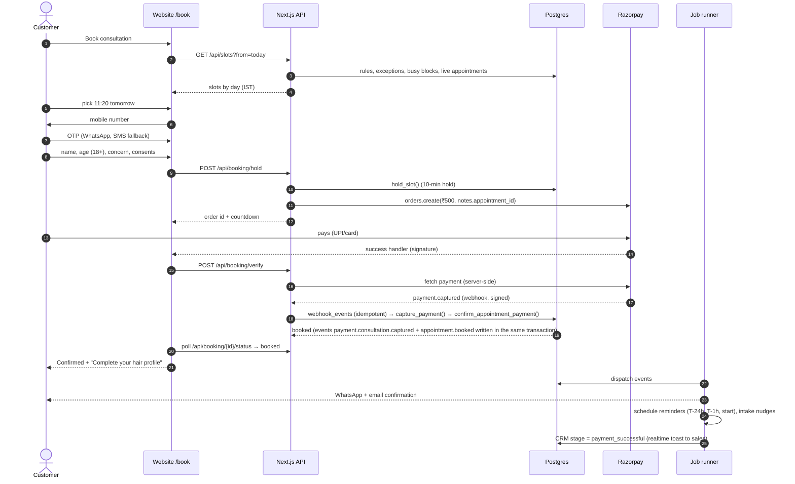

## 2. Late payment after hold expiry (FR-M3-8)

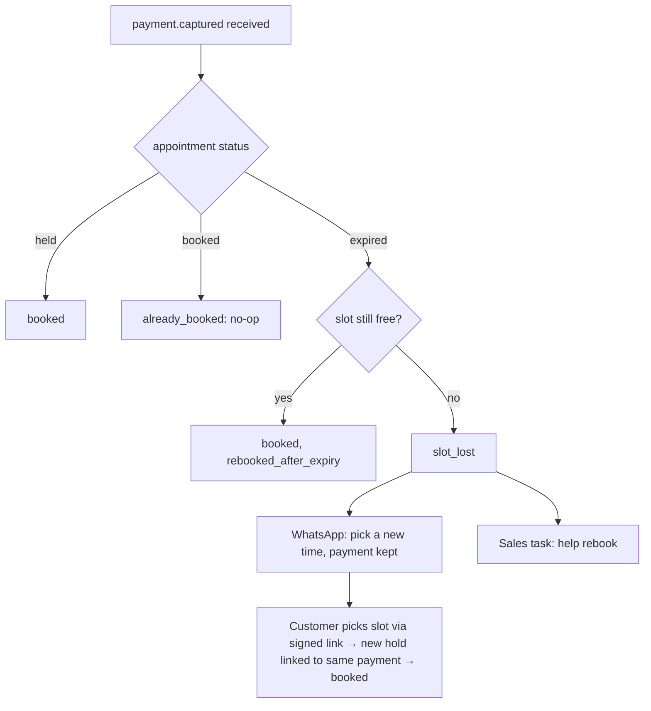

## 3. Consultation → recommendation → one-tap purchase (FR-M5, FR-M6)

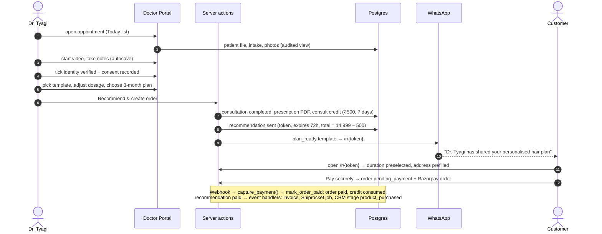

## 4. Post-purchase: delivery, care, refill, reorder (FR-M9, FR-M10)

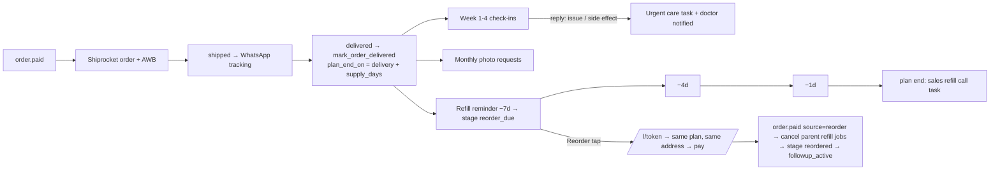

## 5. Guarantee claim (FR-M11)

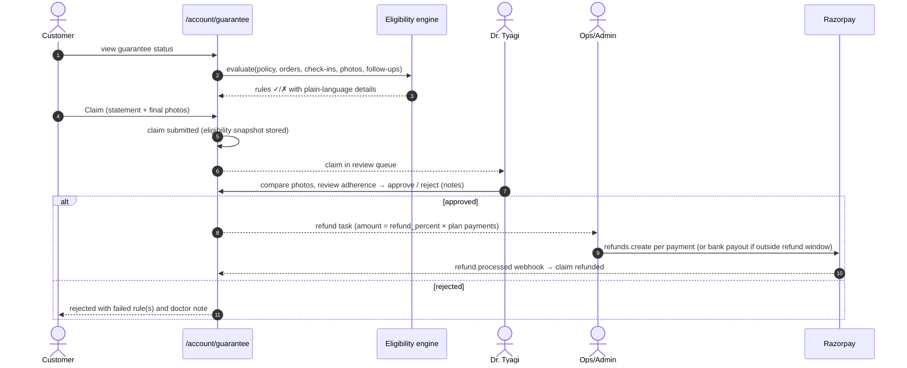

## 6. Lead intake from Meta & WhatsApp (FR-M7-1)

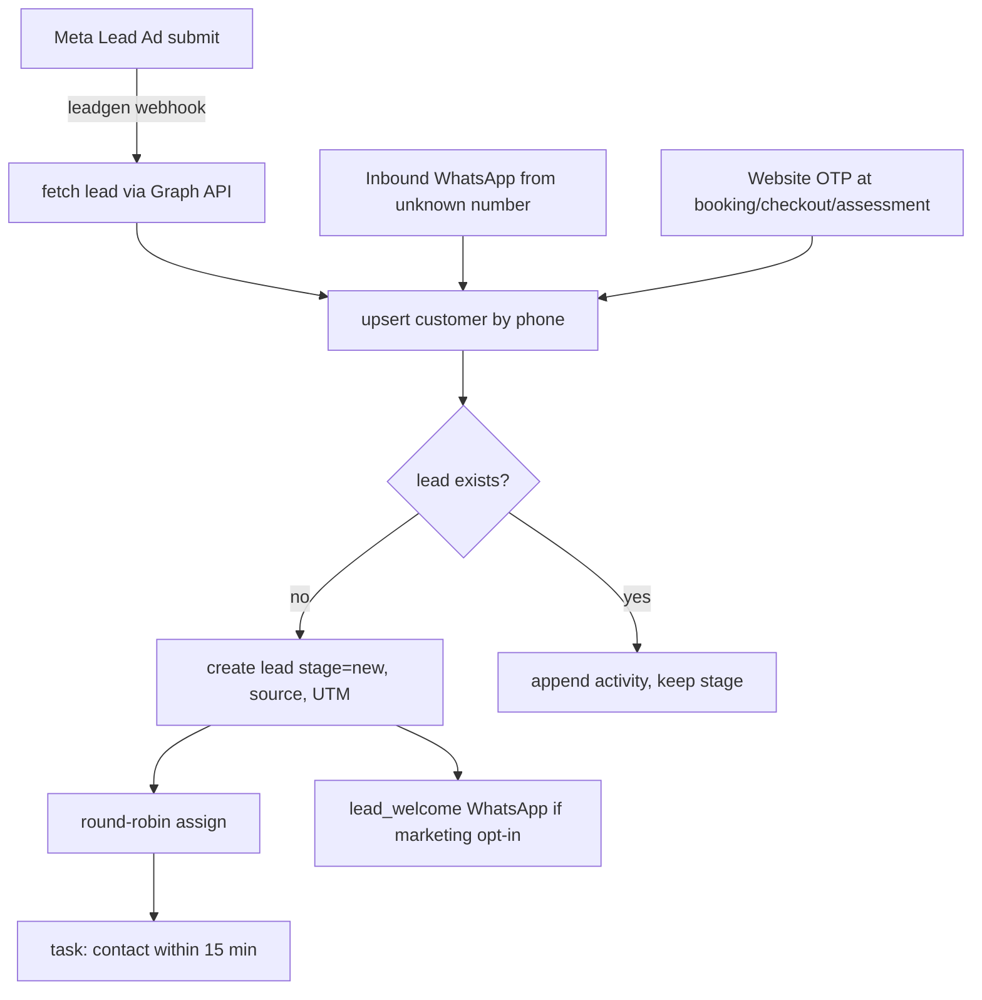

---

## State machines

### Appointment

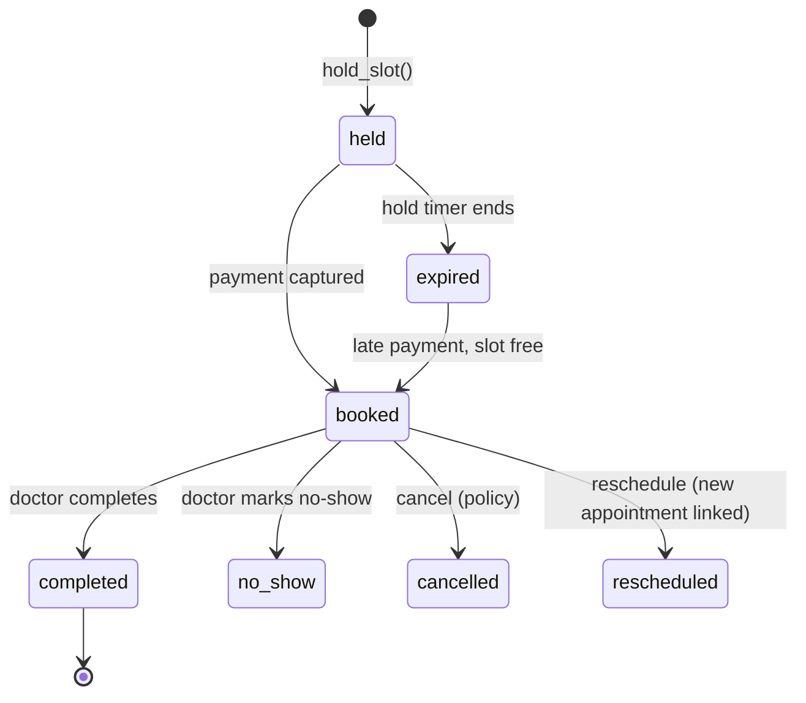

### Order

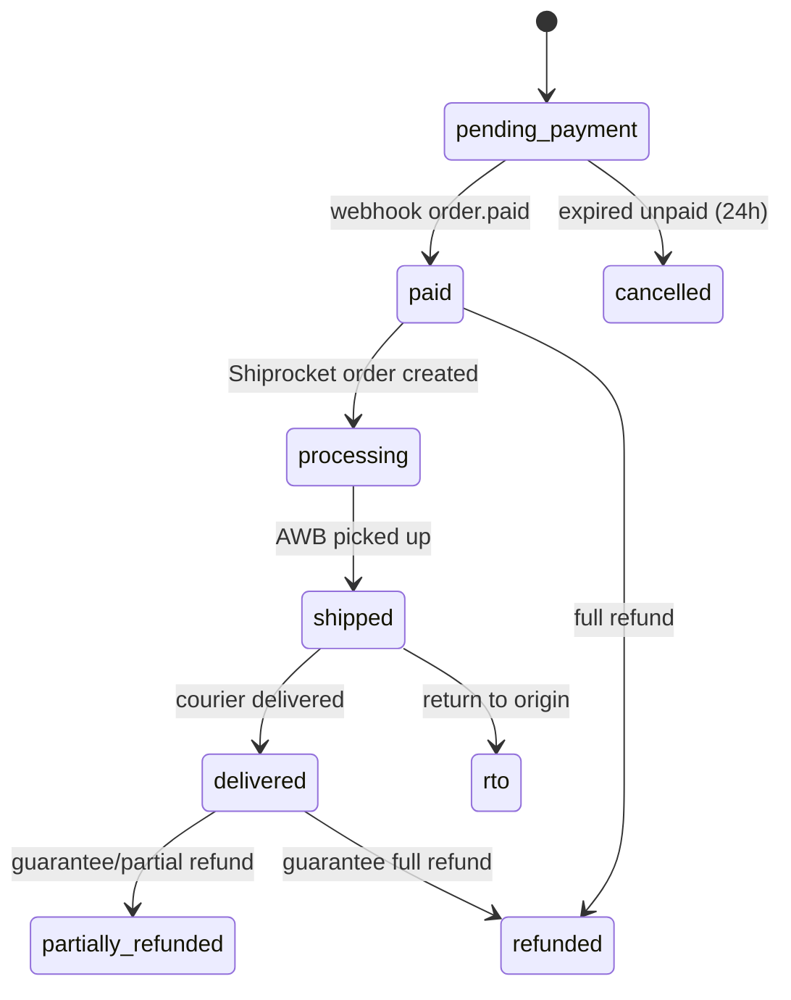

### Recommendation

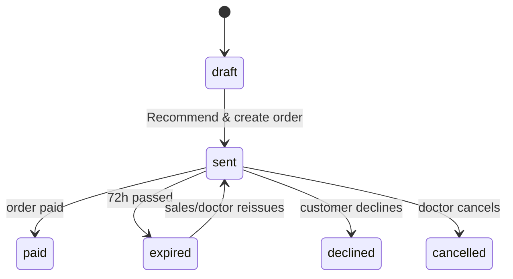

### Lead stage (system moves forward only; loop allowed in retention)

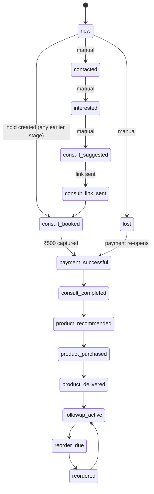

### Guarantee claim

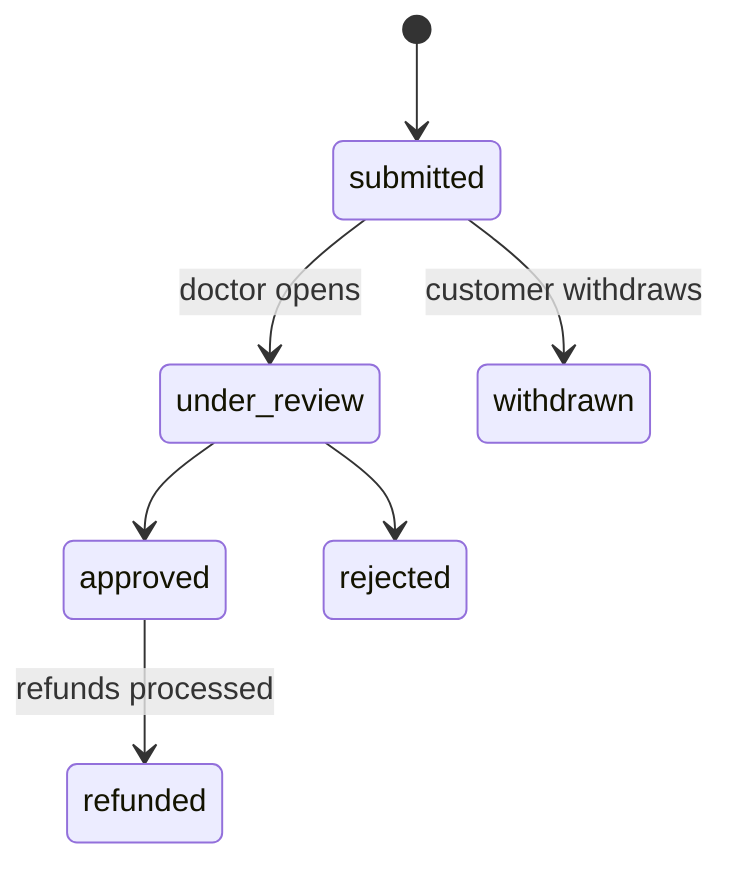
